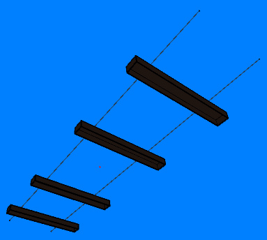
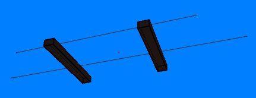

.MAX maxis-archive geometry file format

## Introduction

Geometry data for models (buildings, helicopters, ground objects, etc.) is stored in the three sim3d#.max files. Rough guess at a file format follows.

## Details

*All integers are Intel Little-Endian unless otherwise specified*

```
Header:
'DIRC'
	int32: total size of DIRCchunk, incl. first 8 bytes (aka total file size)
	int32: number of subchunks (typically 2)
'CMAP'
	int32: pointer to CMAP data start (typically 0x1C)
'GEOM'
	int32: pointer to GEOM data start (typically 829)

'CMAP' ("color map" - aka PALETTE)
	int32: size of CMAP block, incl. 8 bytes 'CMAP'int32 header (typically 801)
	int32: number of subblocks (just 1 here)
	
	'CMAP' (subchunk that contains actual palette data)
		int32: ???
		3 x 3 bytes: Transparent colors?  "Magic" fullbright colors?
		int32: (offset 57): pointer to palette start, in file (or DIRC), typically 61
		768 bytes: palette data, RGB, 3x256 with 8 bytes per component (24bits per entry)

'GEOM': geometry data start (typically at offset 829)
	int32: Size of geometry block (includes first 8 bytes containing "GEOM" and size).
	int32: Number of entries in geometry table (N).
	int32: Number of entries in duplicate geometry table (N-1).
	int32: Offset to start of name table (from beginning of file; 853).
	int32: Offset to start of duplicate name table (from beginning of file; 853 + N*53).

	Geometry name table (each entry is 53 bytes long):
		17 bytes: Null-terminated name. First entry contains file name (sim3d#). Bytes following the null character are junk.
		int32: Offset into object table (from beginning of file).
		int32: Object count. For first entry in table, number of objects in file. Otherwise 1.
		int32: Always 0.
		int32: Number of "rendered" vertices, counting shared vertices once for every face that uses them (examples below) and not counting the origin vertex.
		int32: Always 0.
		int32: Always 0.
		int32: Number of faces.
		int32: Number of unique vertices, including the origin vertex. This is the number of vertices stored in the corresponding object block.
		int32: Always 0.

	Duplicate geometry name table (each entry is 36 bytes long):
		9 x int32 in a row, just copies of the int32 set above, except without object count and with a prepended ID. One fewer entry than the previous table (first entry with filename is omitted).

	Object table:
		Offsets are stored in the first int32 in the name table

'OBJX': marks an Object.  Items in the Names table point here.
	int32: size.  Incl. header. But bugged: must add 12 bytes.
	int16: Number of Vertices in Vertex-array Block
	int16: Number of Faces
	int32: always 0
	int32: ???? maybe a scale factor, a unique ID or a CRC or something
	int32: always 0
	88 bytes: null-terminated, null-padded object name
	12 bytes:  JUNK.  This is where the bug comes in, above: somebody at Maxis calculated sizeof(Name) wrong.

	Vertex table (immediately follows the OBJX header)
		UniqueVertexCount * [x: int32, y: int32, z: int32]: Vertex array.  X, Y, Z coords, as signed int32 one after another.  First vertex in the list is the Origin.

	'FACE': A face (immediately follows the Vertex table)
		int32: size, incl. header
		int16: Number of vertices. 1 for single vertices (e.g., flashing lights), 2 for edges (e.g., lane markings on roads), 3+ for polygons.
		int16: flags?
		int16: is_light
		int32: face_group
		byte: ???
		byte: texnum / color (if tex_file != 0, this is an index into the texture atlas)
		byte: tex_file
		vertices * int16: Reference into Vertex table, above
		vertices * [4 * int16]: face vertex flags. 4 shorts per vertex in a face. Something to do with texture coordinates?
```

### General Notes

* The entries in the geometry name table and duplicate geometry name table aren't used by SimCopter, with the exception of the first entry in the geometry name table (the metadata entry containing the file name and total number of objects, vertices, and faces). This was determined by replacing all the bytes in these tables with zeroes (except for those of the metadata entry), which had no effect when running the game.

### Rendered Vertices vs. Unique Vertices

The GEOM table contains two values for the number of vertices:
* The first value counts shared vertices once for every face that uses them and doesn't include the origin vertex.
  * For example, six vertices used to form two quads sharing one edge will count as eight.
  * Including this value with the mesh data (rather than computing it at runtime) may have permitted a rendering optimization. It's not clear if these meshes include smoothing groups (gradients are used when rendering some faces), but if they do, this value could be related to whether or not connected faces are in the same group.
* The second value counts only unique vertices and includes the origin.
  * This is the number of vertices stored in the corresponding object block.

Some examples:

**Mesh RL44 from SimCopter sim3d2.max**


* Number of rendered vertices: 84 = (4 railroad ties * 5 quads per tie (no bottom face) * 4 vertices per quad) + (2 rails * 2 vertices per edge)
* Number of unique vertices: 37 = (4 railroad ties * 8 vertices per tie) + (2 rails * 2 vertices per edge) + 1 origin vertex

**Mesh RL50 from SimCopter sim3d2.max**


* Number of rendered vertices: 44 = (2 railroad ties * 5 quads per tie (no bottom face) * 4 vertices per quad) + (2 rails * 2 vertices per edge)
* Number of unique vertices: 21 = (2 railroad ties * 8 vertices per tie) + (2 rails * 2 vertices per edge) + 1 origin vertex
